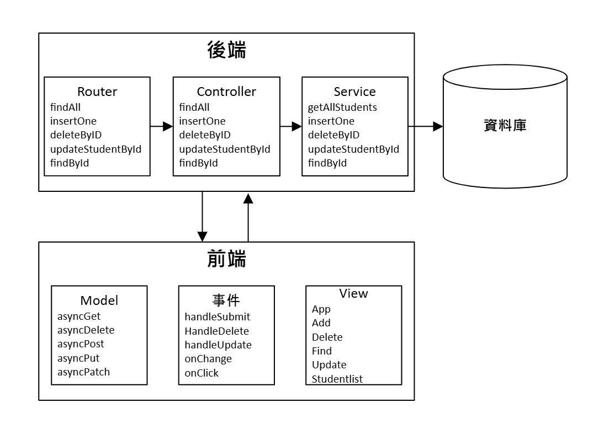
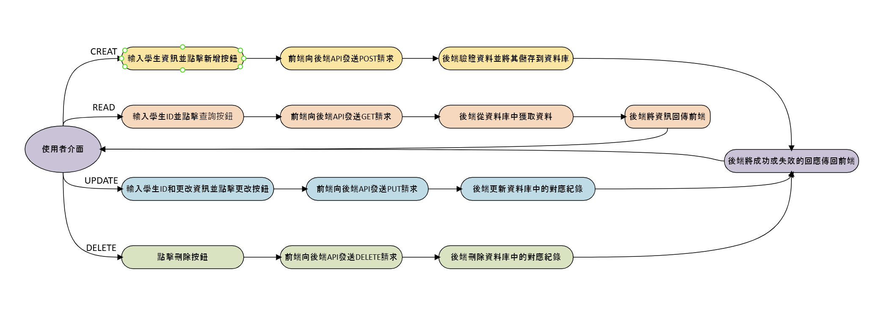

# studenthub

# 安裝與執行指引

## 概述
了解如何安裝程式以及執行程式碼


## 下載檔案
開啟終端機cd到想要的資料夾
```
git clone https://github.com/willybigboat/studenthub.git
```

## cd到資料夾並安裝驅動程式
```
cd studenthub/mongoDB
npm i
cd studenthub/react-ts-mid
npm i
```
接著在裡面的.env檔內更改需要的資訊

## cd到資料夾並啟動
```
cd studenthub/mongoDB
npm run dev
cd studenthub/react-ts-mid
npm run dev
```
點擊網站

# API

## 概述
此 API 提供管理使用者資料的 CRUD 操作。所有端點遵循 RESTful 原則並返回 JSON 格式的回應。

---

## 基本網址
```
http://localhost:7000/api/v1/user
```

---

## 端點

### 1. 取得所有使用者
**端點：**
```
GET /findAll
```

**描述：**
獲取所有使用者的列表。

**請求：**
無需請求主體或參數。

**回應範例：**
```json
[
  {
    "id": "1",
    "name": "John Doe",
    "email": "john.doe@example.com"
  },
  {
    "id": "2",
    "name": "Jane Smith",
    "email": "jane.smith@example.com"
  }
]
```

---

### 2. 新增使用者
**端點：**
```
POST /insertOne
```

**描述：**
新增一個使用者。

**請求主體：**
```json
{
  "name": "John Doe",
  "email": "john.doe@example.com"
}
```

**回應範例：**
```json
{
  "id": "123",
  "name": "John Doe",
  "email": "john.doe@example.com"
}
```

**HTTP 狀態碼：**
- 201: 使用者新增成功。
- 400: 無效的請求內容。

---

### 3. 根據 ID 刪除使用者
**端點：**
```
DELETE /deleteByID/{id}
```

**描述：**
根據使用者的唯一 ID 刪除該使用者。

**路徑參數：**
- `id` (string): 使用者的唯一標識符。

**回應範例：**
```json
{
  "message": "User deleted successfully"
}
```

**HTTP 狀態碼：**
- 200: 使用者刪除成功。
- 404: 找不到使用者。

---

### 4. 根據 ID 查詢使用者
**端點：**
```
GET /findById/{id}
```

**描述：**
根據使用者的唯一 ID 獲取該使用者的詳細資訊。

**路徑參數：**
- `id` (string): 使用者的唯一標識符。

**回應範例：**
```json
{
  "id": "123",
  "name": "John Doe",
  "email": "john.doe@example.com"
}
```

**HTTP 狀態碼：**
- 200: 找到使用者。
- 404: 找不到使用者。

---

### 5. 根據 ID 更新使用者
**端點：**
```
PUT /updateStudentById/{id}
```

**描述：**
根據使用者的唯一 ID 更新其詳細資訊。

**路徑參數：**
- `id` (string): 使用者的唯一標識符。

**請求主體：**
```json
{
  "name": "John Updated",
  "email": "john.updated@example.com"
}
```

**回應範例：**
```json
{
  "id": "123",
  "name": "John Updated",
  "email": "john.updated@example.com"
}
```

**HTTP 狀態碼：**
- 200: 使用者更新成功。
- 400: 無效的請求內容。
- 404: 找不到使用者。

---

# 架構圖


# 流程圖


# Demo影片
[https://youtu.be/NiD8K4HLRBk](https://youtu.be/NiD8K4HLRBk)